## Develer Workshop: "Introduzione a React Native"

Questo repository git contiene il codice relativo alla parte "hands-on" del workshop.  
Ad ogni "step" della parte hands-on corrisponde un branch git nel repo.  

Dopo aver clonato il repo con:

```
git clone <repo-url>
```

è possibile saltare ai vari step con `git checkout`.  
Per esempio, se lo step 2 corrisponde al branch `step-2` si dovrà lanciare il comando:

```
git checkout step-2
```

## Descrizione dei vari step

Di seguito una breve descrizione dei vari step dello workshop:

### Step 1: Setup ambiente ed esecuzione "Hello World" React Native
L'obiettivo dello step è eseguire con successo l' "hello world" di React Native su device fisico o su simulatore.  
  
  *Git command:* `git checkout step-1`

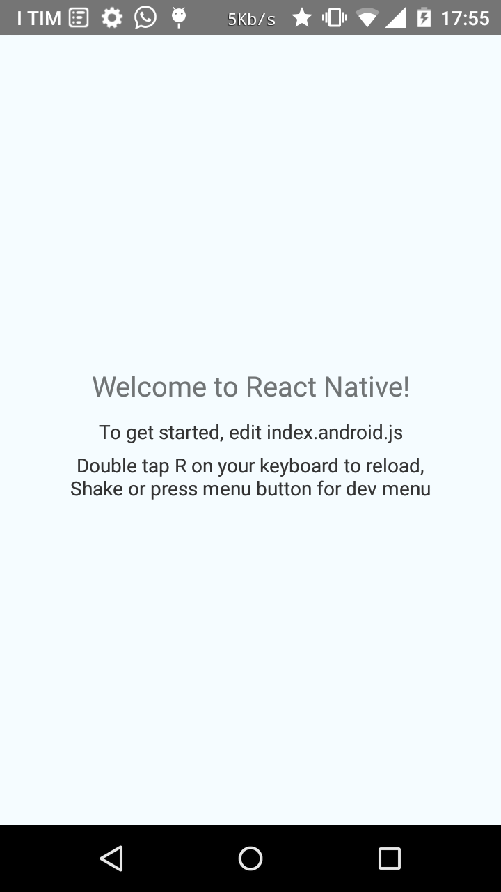
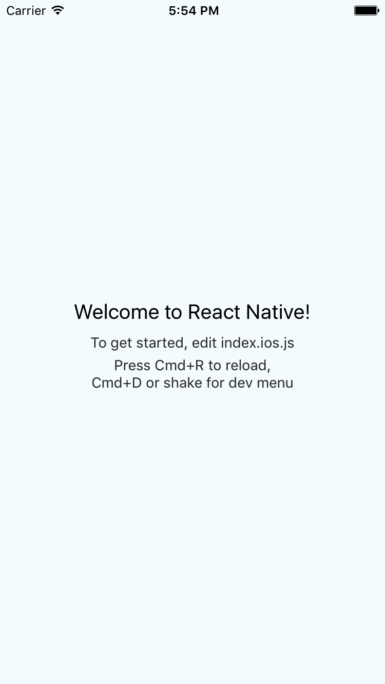

Argomenti toccati:  

* Setup ambiente react-native
* Architettura react-native
* Packager
* Esecuzione su device e simulatore
  
La guida online dettagliata con tutti i passi necessari per il setup dell'ambiente (prerequisiti per poter partecipare alla sessione pratica) è disponibile all'indirizzo:
  
  [https://facebook.github.io/react-native/docs/getting-started.html](https://facebook.github.io/react-native/docs/getting-started.html)
  
  Per accedere allo step successivo si devono poter eseguire con successo i comandi:
  
  * `react-native run-android` e/o 
  * `react-native run-ios` 
  
  a seconda della piattaforma mobile prescelta.   
  
### Step 2: Home page main layout
L'obiettivo dello step è implementare il layout della home page dell'app.

*Git command:* `git checkout step-2`

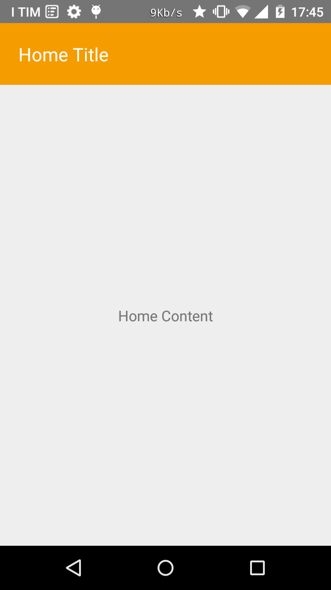
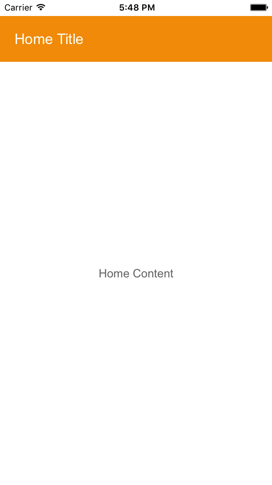

Argomenti toccati:

* Flexbox
* Fogli di stile
* Codice ad-hoc per le due piattaforme iOS e Android
* Live reload

### Step 3: Liste di elementi
L'obiettivo dello step è utilizzare il componente `ListView` di React Native per mostrare una lista di testi in home page.

*Git command:* `git checkout step-3`

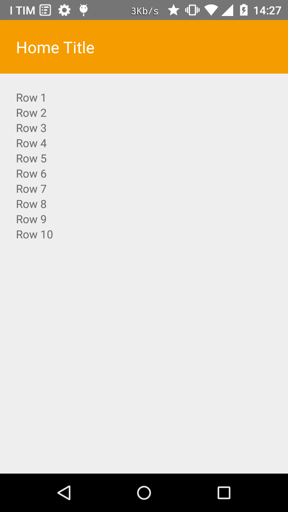
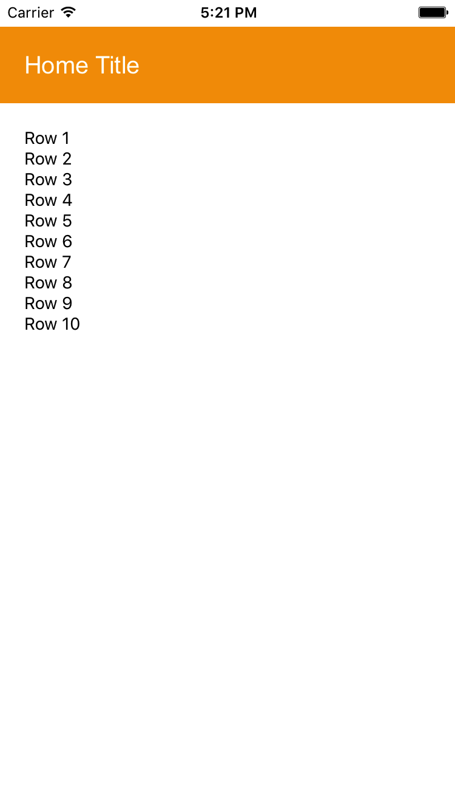

Argomenti toccati:

* Componente `ListView` e sorgente di dati
* Lambda ES6

### Step 4: Setup data e layout del singolo contatto
L'obiettivo dello step è costruire il layout finale per il singolo contatto nella lista.

*Git command:* `git checkout step-4`

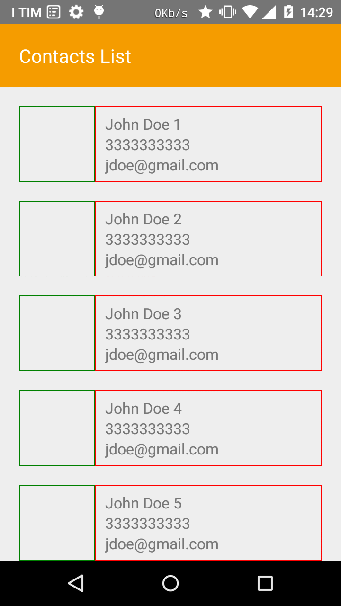
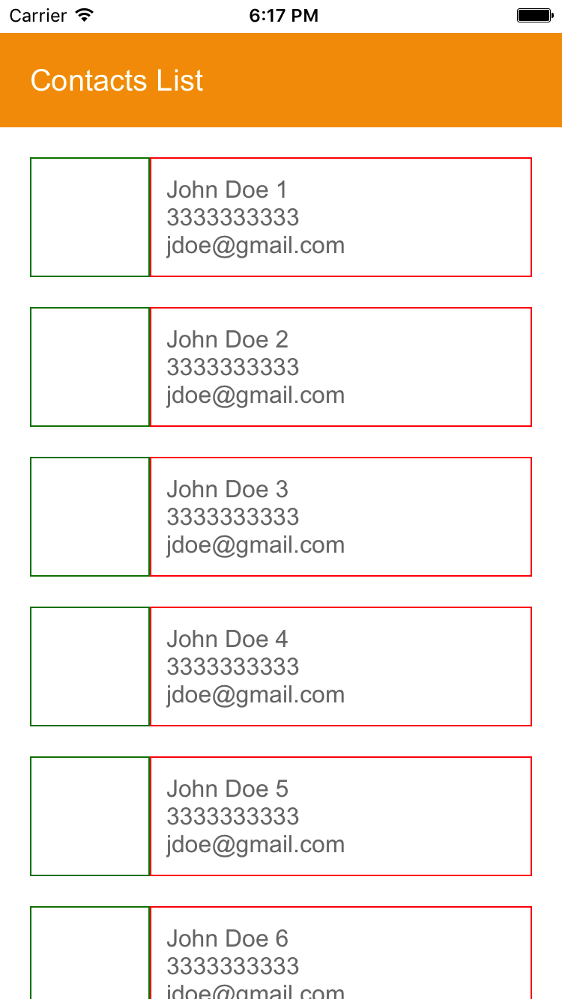

Argomenti toccati:

* Uso di oggetti Javascript per descrivere i dati dei contatti
* Flexbox e fogli di stile più in dettaglio

### Step 5: Immagini, email e chiamate
L'obiettivo dello step è mostrare l'immagine profilo degli utenti e rendere cliccabili email e numeri di telefono lanciando l'app per email nativa o il dialer di sistema.

*Git commmand:* `git checkout step-5`


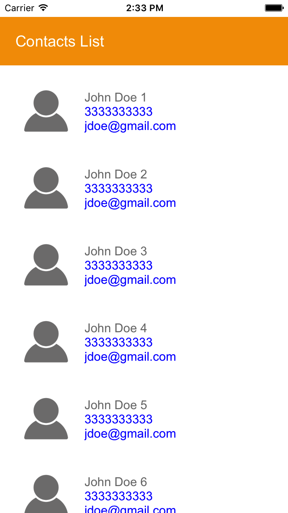

Argomenti toccati:

* Fetch immagini da remoto
* Apertura di link

### Step 6: Fetch lista contatti da server
L'obiettivo dello step è recuperare la lista di contatti da server.

*Git command:* `git checkout step-6`

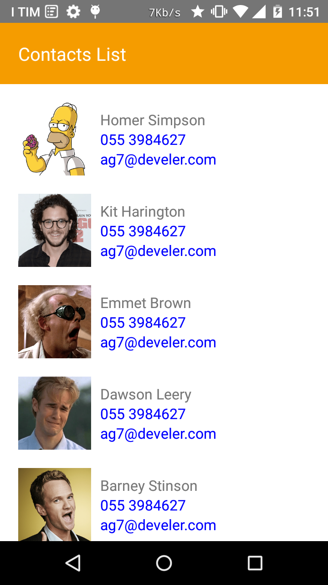
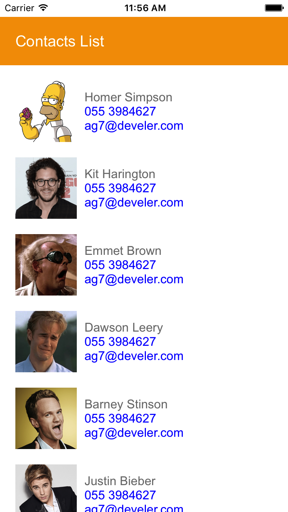

* GET e POST request con il costrutto "fetch"
* Promises ES6
